# Catalog

`mermaid-pretty` の `pretty` テーマで描画した全 12 種類のダイアグラムのギャラリー。
各図は [`examples/`](../../examples) 配下の `.mmd` ソースから `mmp <file>.mmd` で生成したもの。

| # | Diagram | Preview |
|---|---|---|
| 1 | [Flowchart](#flowchart) |  |
| 2 | [Sequence](#sequence) | 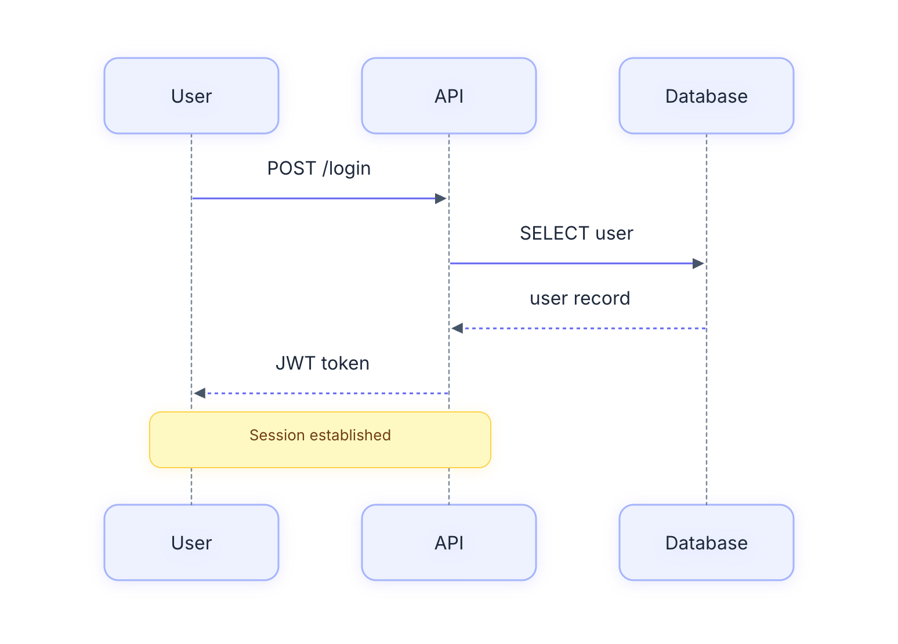 |
| 3 | [Class](#class) | 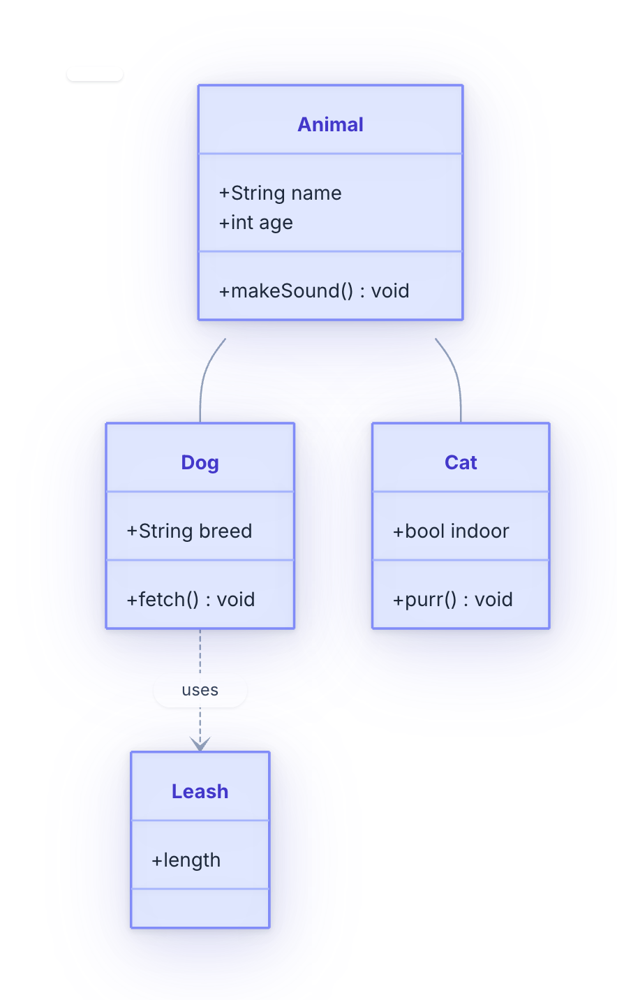 |
| 4 | [State](#state) | 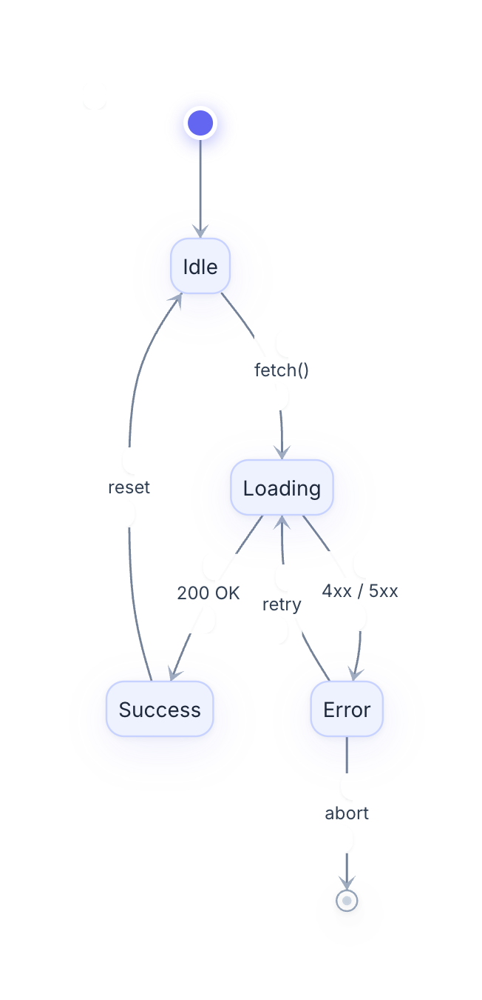 |
| 5 | [ER](#er) | 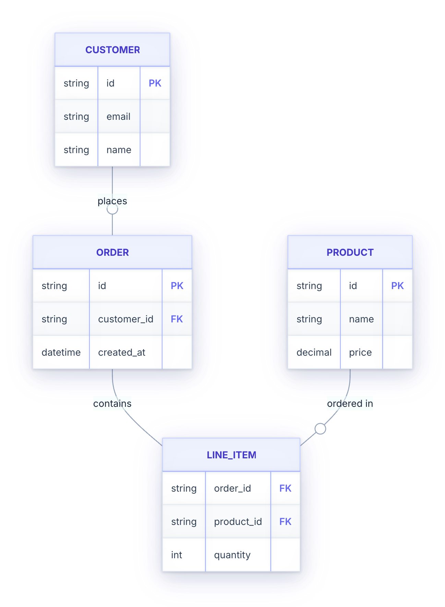 |
| 6 | [Gantt](#gantt) | 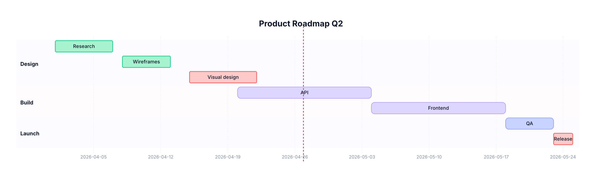 |
| 7 | [Pie](#pie) | 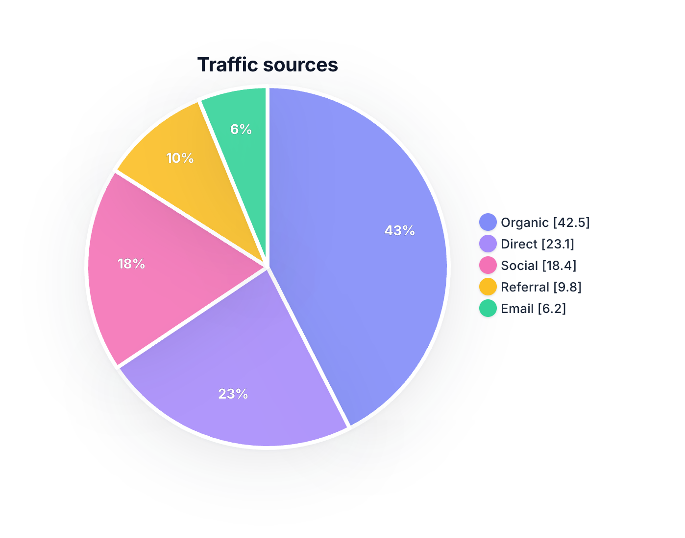 |
| 8 | [Mindmap](#mindmap) | 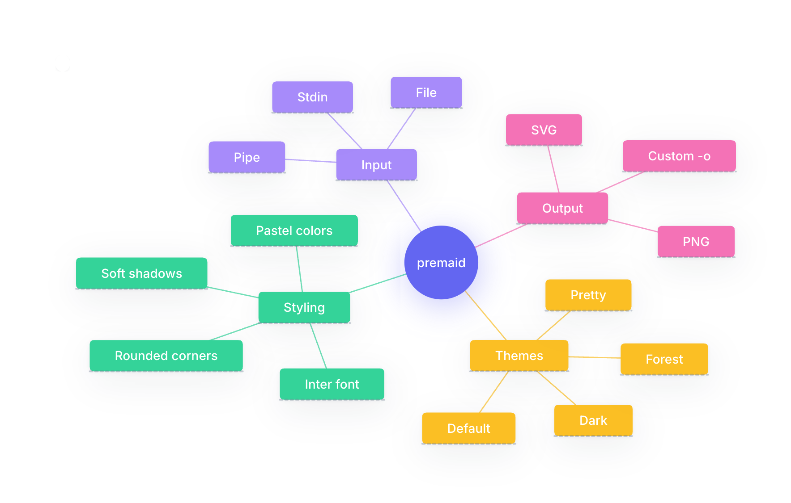 |
| 9 | [Timeline](#timeline) | 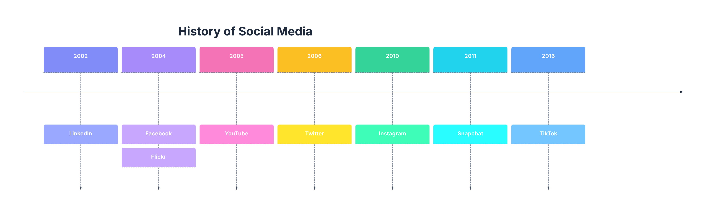 |
| 10 | [Journey](#journey) | 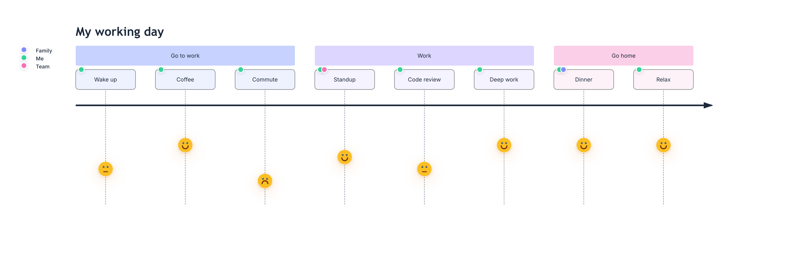 |
| 11 | [GitGraph](#gitgraph) | 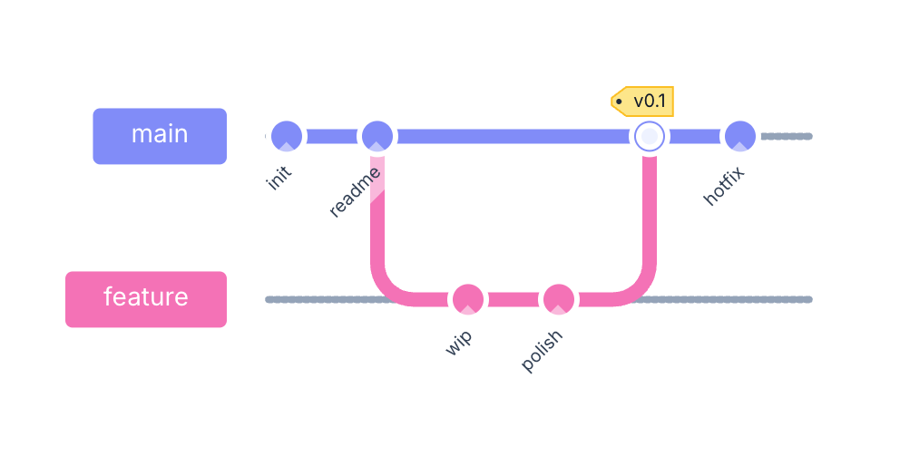 |
| 12 | [Quadrant](#quadrant) | 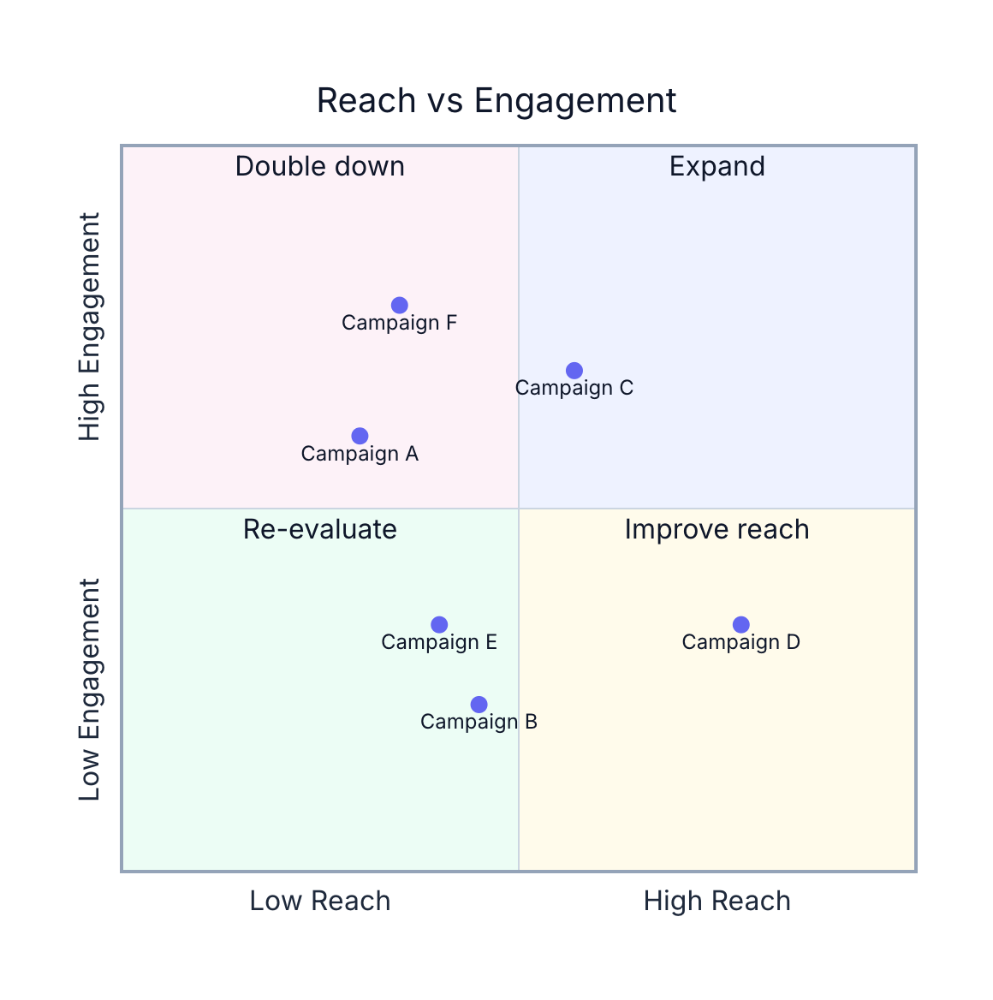 |

---

## Flowchart


<details><summary>Source</summary>

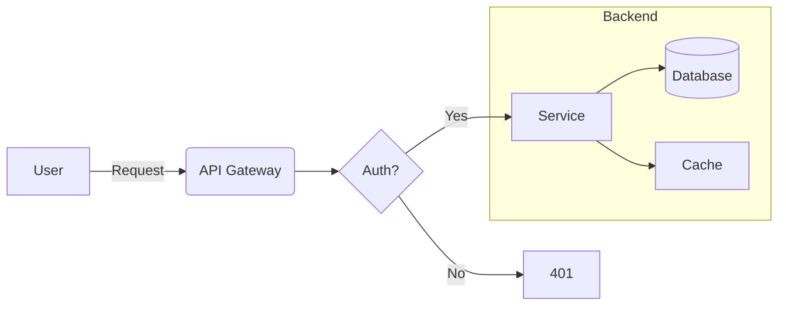
```mermaid
flowchart LR
    A[User] -->|Request| B(API Gateway)
    B --> C{Auth?}
    C -->|Yes| D[Service]
    C -->|No| E[401]
    D --> F[(Database)]
    D --> G[Cache]

    subgraph Backend
        D
        F
        G
    end
```

</details>

Source: [`examples/flowchart.mmd`](../../examples/flowchart.mmd) · [SVG](images/flowchart.svg)

---

## Sequence


<details><summary>Source</summary>

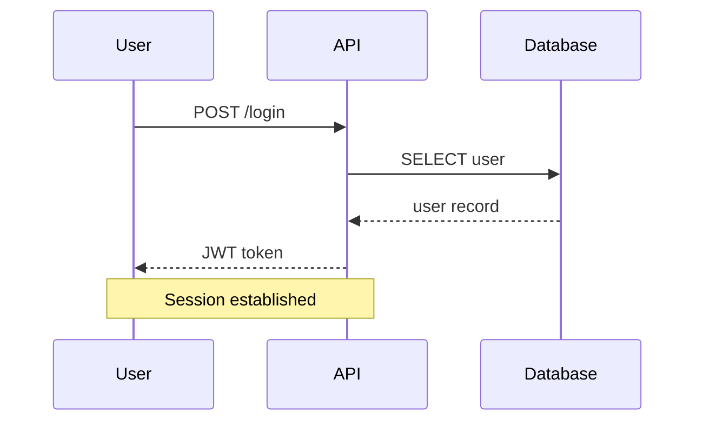
```mermaid
sequenceDiagram
    participant U as User
    participant A as API
    participant DB as Database
    U->>A: POST /login
    A->>DB: SELECT user
    DB-->>A: user record
    A-->>U: JWT token
    Note over U,A: Session established
```

</details>

Source: [`examples/sequence.mmd`](../../examples/sequence.mmd) · [SVG](images/sequence.svg)

---

## Class


<details><summary>Source</summary>

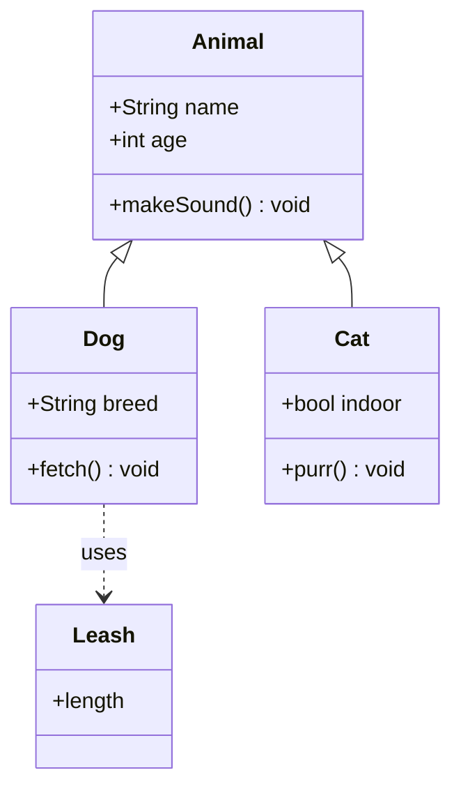
```mermaid
classDiagram
    class Animal {
        +String name
        +int age
        +makeSound() void
    }
    class Dog {
        +String breed
        +fetch() void
    }
    class Cat {
        +bool indoor
        +purr() void
    }
    Animal <|-- Dog
    Animal <|-- Cat
    Dog ..> Leash : uses
    class Leash {
        +length
    }
```

</details>

Source: [`examples/class.mmd`](../../examples/class.mmd) · [SVG](images/class.svg)

---

## State


<details><summary>Source</summary>

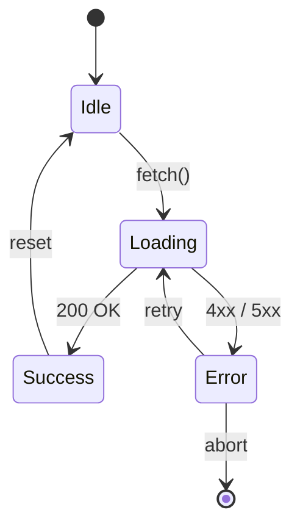
```mermaid
stateDiagram-v2
    [*] --> Idle
    Idle --> Loading: fetch()
    Loading --> Success: 200 OK
    Loading --> Error: 4xx / 5xx
    Success --> Idle: reset
    Error --> Loading: retry
    Error --> [*]: abort
```

</details>

Source: [`examples/state.mmd`](../../examples/state.mmd) · [SVG](images/state.svg)

---

## ER


<details><summary>Source</summary>

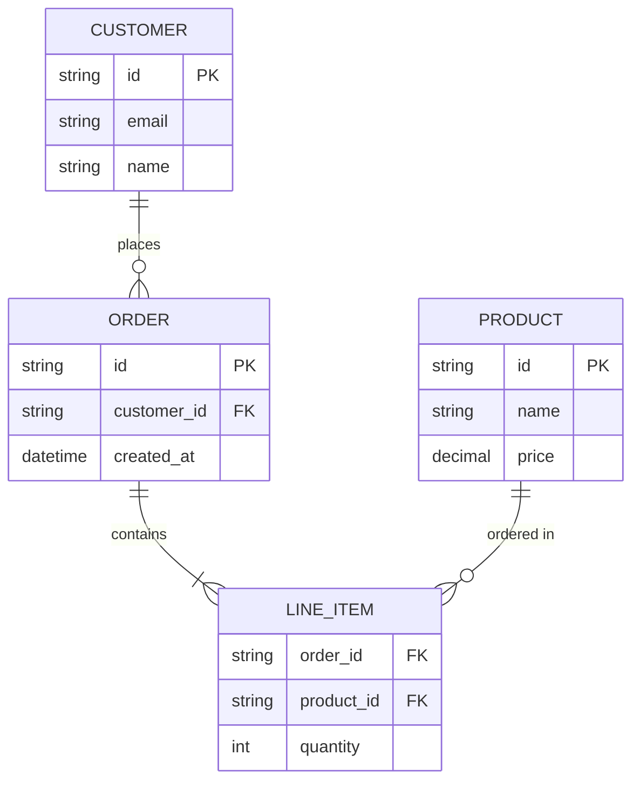
```mermaid
erDiagram
    CUSTOMER ||--o{ ORDER : places
    ORDER ||--|{ LINE_ITEM : contains
    PRODUCT ||--o{ LINE_ITEM : "ordered in"
    CUSTOMER {
        string id PK
        string email
        string name
    }
    ORDER {
        string id PK
        string customer_id FK
        datetime created_at
    }
    LINE_ITEM {
        string order_id FK
        string product_id FK
        int quantity
    }
    PRODUCT {
        string id PK
        string name
        decimal price
    }
```

</details>

Source: [`examples/er.mmd`](../../examples/er.mmd) · [SVG](images/er.svg)

---

## Gantt


<details><summary>Source</summary>

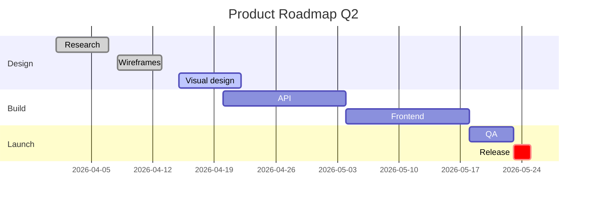
```mermaid
gantt
    title Product Roadmap Q2
    dateFormat  YYYY-MM-DD
    section Design
    Research           :done,    des1, 2026-04-01, 2026-04-07
    Wireframes         :done,    des2, 2026-04-08, 5d
    Visual design      :active,  des3, 2026-04-15, 7d
    section Build
    API                :         b1,   2026-04-20, 14d
    Frontend           :         b2,   after b1, 14d
    section Launch
    QA                 :         l1,   after b2, 5d
    Release            :crit,    l2,   after l1, 2d
```

</details>

Source: [`examples/gantt.mmd`](../../examples/gantt.mmd) · [SVG](images/gantt.svg)

---

## Pie


<details><summary>Source</summary>

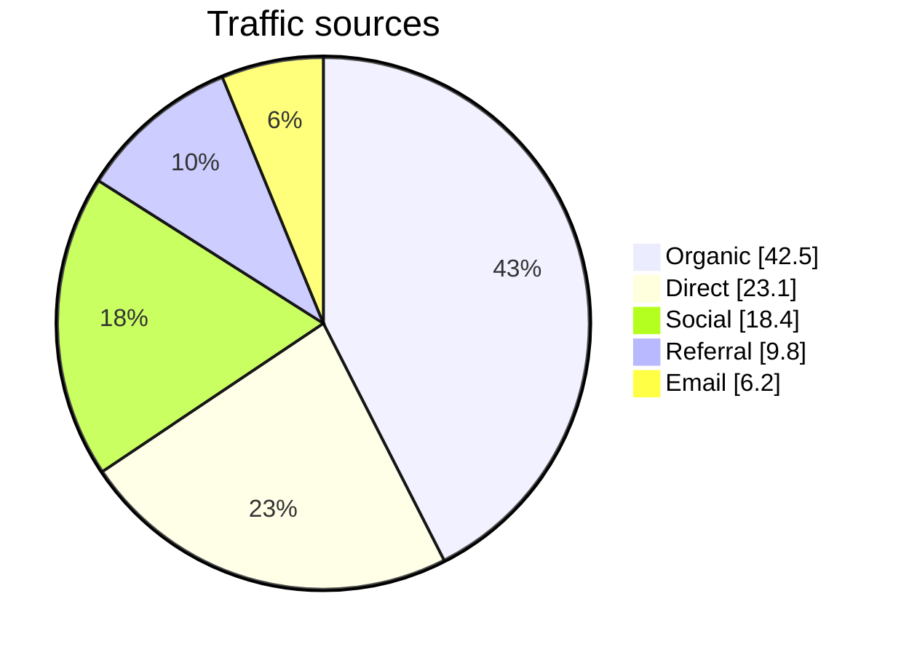
```mermaid
pie showData
    title Traffic sources
    "Organic" : 42.5
    "Direct"  : 23.1
    "Social"  : 18.4
    "Referral" : 9.8
    "Email"   : 6.2
```

</details>

Source: [`examples/pie.mmd`](../../examples/pie.mmd) · [SVG](images/pie.svg)

---

## Mindmap


<details><summary>Source</summary>

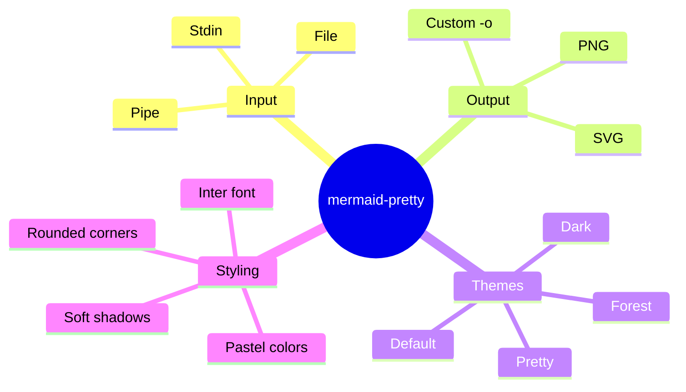
```mermaid
mindmap
  root((mermaid-pretty))
    Input
      File
      Stdin
      Pipe
    Output
      SVG
      PNG
      Custom -o
    Themes
      Pretty
      Dark
      Default
      Forest
    Styling
      Soft shadows
      Rounded corners
      Inter font
      Pastel colors
```

</details>

Source: [`examples/mindmap.mmd`](../../examples/mindmap.mmd) · [SVG](images/mindmap.svg)

---

## Timeline


<details><summary>Source</summary>

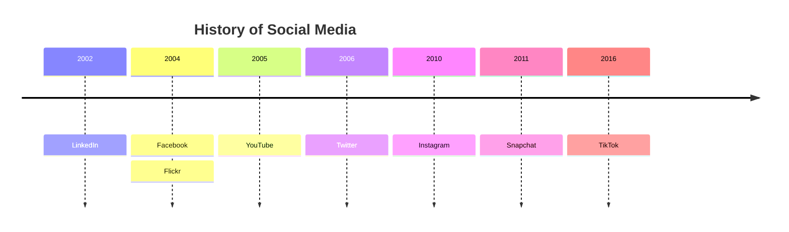
```mermaid
timeline
    title History of Social Media
    2002 : LinkedIn
    2004 : Facebook
         : Flickr
    2005 : YouTube
    2006 : Twitter
    2010 : Instagram
    2011 : Snapchat
    2016 : TikTok
```

</details>

Source: [`examples/timeline.mmd`](../../examples/timeline.mmd) · [SVG](images/timeline.svg)

---

## Journey


<details><summary>Source</summary>

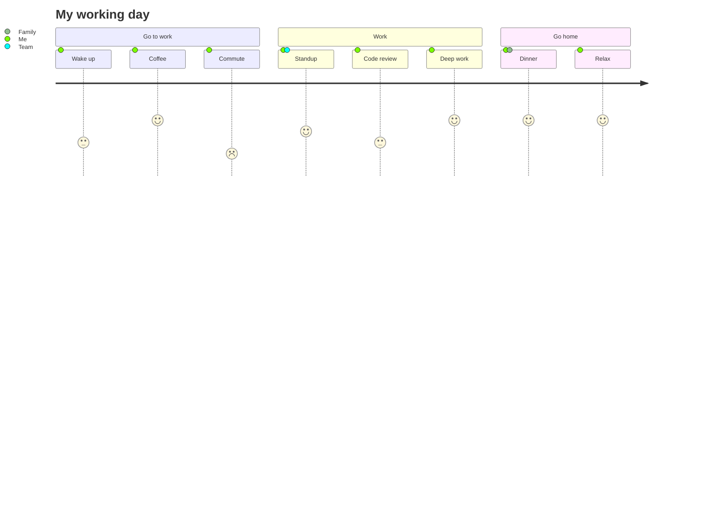
```mermaid
journey
    title My working day
    section Go to work
      Wake up: 3: Me
      Coffee: 5: Me
      Commute: 2: Me
    section Work
      Standup: 4: Me, Team
      Code review: 3: Me
      Deep work: 5: Me
    section Go home
      Dinner: 5: Me, Family
      Relax: 5: Me
```

</details>

Source: [`examples/journey.mmd`](../../examples/journey.mmd) · [SVG](images/journey.svg)

---

## GitGraph


<details><summary>Source</summary>

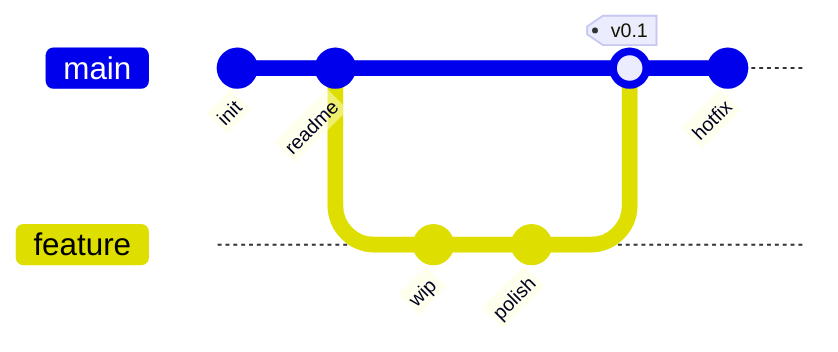
```mermaid
gitGraph
    commit id: "init"
    commit id: "readme"
    branch feature
    checkout feature
    commit id: "wip"
    commit id: "polish"
    checkout main
    merge feature tag: "v0.1"
    commit id: "hotfix"
```

</details>

Source: [`examples/gitgraph.mmd`](../../examples/gitgraph.mmd) · [SVG](images/gitgraph.svg)

---

## Quadrant


<details><summary>Source</summary>

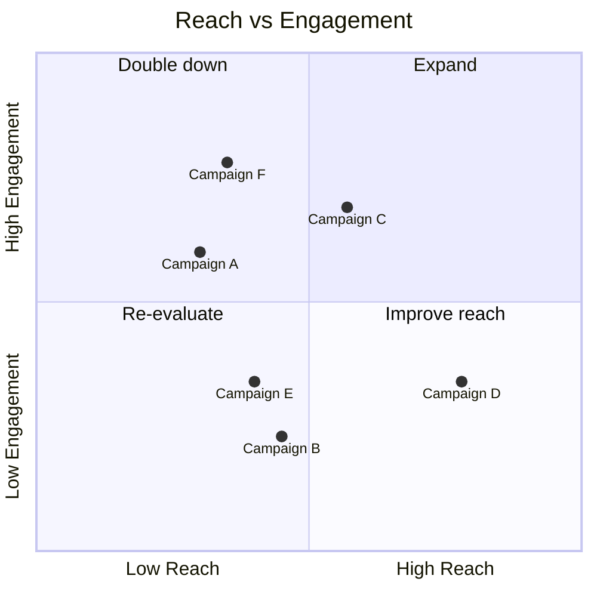
```mermaid
quadrantChart
    title Reach vs Engagement
    x-axis Low Reach --> High Reach
    y-axis Low Engagement --> High Engagement
    quadrant-1 Expand
    quadrant-2 Double down
    quadrant-3 Re-evaluate
    quadrant-4 Improve reach
    Campaign A: [0.3, 0.6]
    Campaign B: [0.45, 0.23]
    Campaign C: [0.57, 0.69]
    Campaign D: [0.78, 0.34]
    Campaign E: [0.4, 0.34]
    Campaign F: [0.35, 0.78]
```

</details>

Source: [`examples/quadrant.mmd`](../../examples/quadrant.mmd) · [SVG](images/quadrant.svg)

---

## Regenerate

```bash
# このカタログ全体を再生成
for f in flowchart sequence class state er gantt pie mindmap timeline journey gitgraph quadrant; do
  mmp "examples/${f}.mmd" -o "docs/catalog/images/${f}"
done
```
