# Catalog

`mermaid-pretty` の `pretty` テーマで描画した全 12 種類のダイアグラムのギャラリー。
各図は [`examples/`](../../examples) 配下の `.mmd` ソースから `mmp <file>.mmd` で生成したもの。

## Gallery

| | | |
|---|---|---|
| **[Flowchart](#flowchart)**<br> | **[Sequence](#sequence)**<br> | **[Class](#class)**<br> |
| **[State](#state)**<br> | **[ER](#er)**<br> | **[Gantt](#gantt)**<br> |
| **[Pie](#pie)**<br> | **[Mindmap](#mindmap)**<br> | **[Timeline](#timeline)**<br> |
| **[Journey](#journey)**<br> | **[GitGraph](#gitgraph)**<br> | **[Quadrant](#quadrant)**<br> |

## Sources

各図の見出しから元の `.mmd` ソースと SVG に飛べます。

### Flowchart

[`examples/flowchart.mmd`](../../examples/flowchart.mmd) · [SVG](images/flowchart.svg)

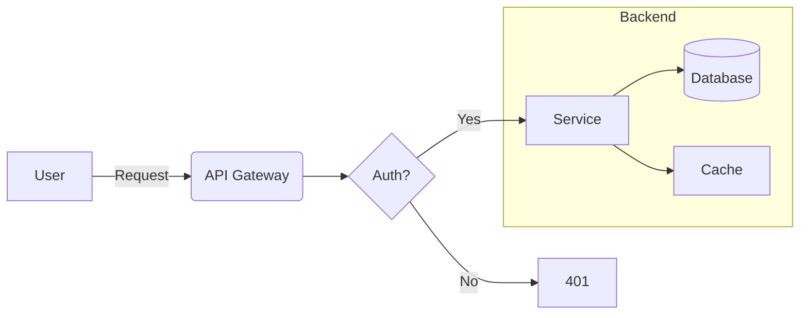

### Sequence

[`examples/sequence.mmd`](../../examples/sequence.mmd) · [SVG](images/sequence.svg)

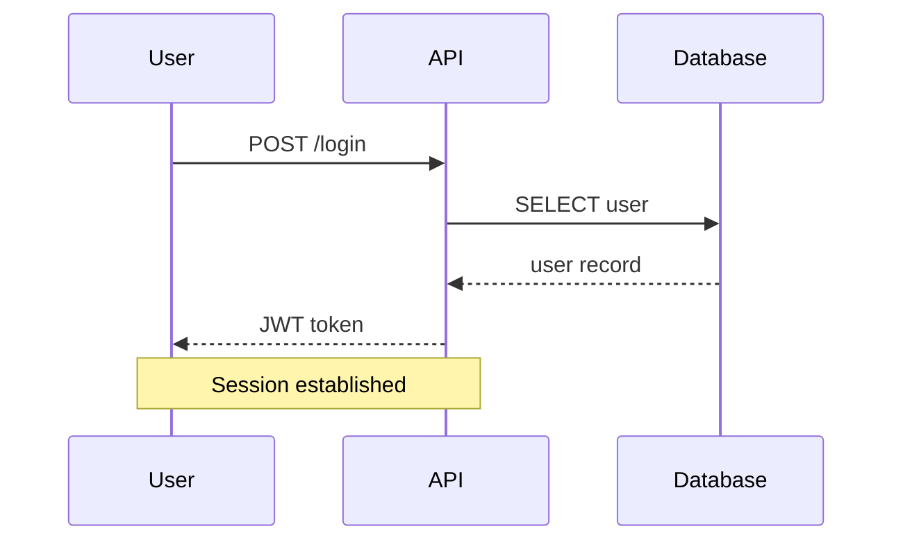

### Class

[`examples/class.mmd`](../../examples/class.mmd) · [SVG](images/class.svg)

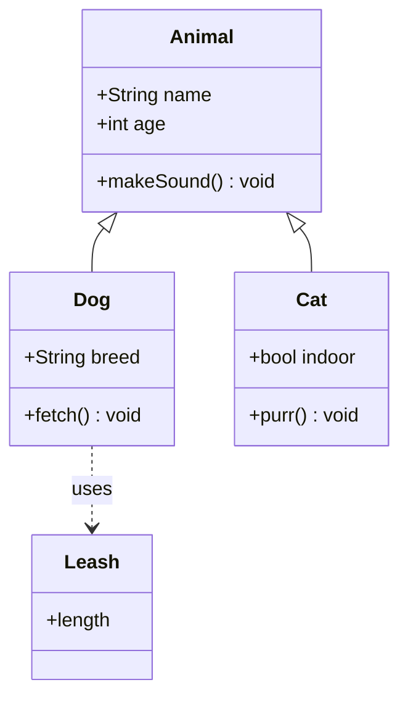

### State

[`examples/state.mmd`](../../examples/state.mmd) · [SVG](images/state.svg)

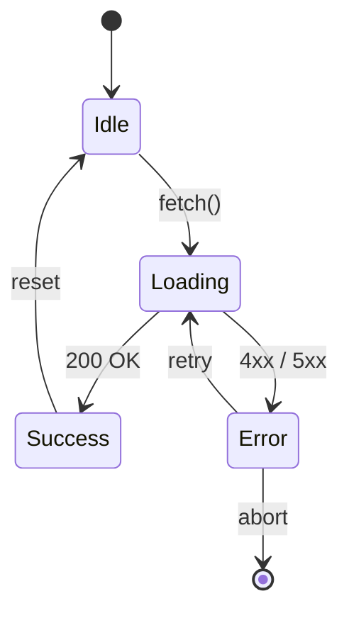

### ER

[`examples/er.mmd`](../../examples/er.mmd) · [SVG](images/er.svg)

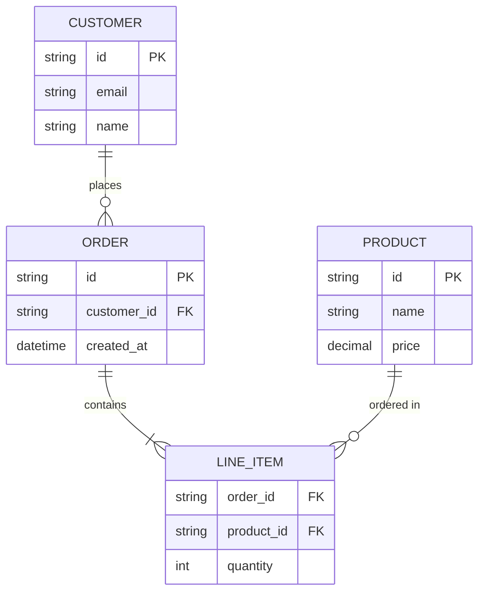

### Gantt

[`examples/gantt.mmd`](../../examples/gantt.mmd) · [SVG](images/gantt.svg)

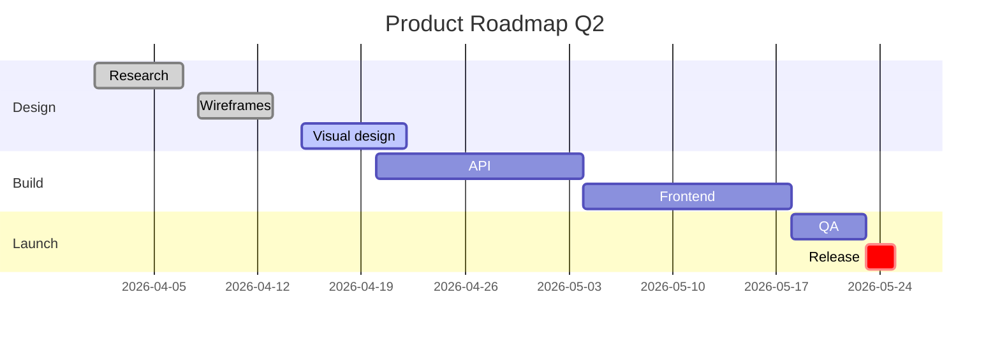

### Pie

[`examples/pie.mmd`](../../examples/pie.mmd) · [SVG](images/pie.svg)

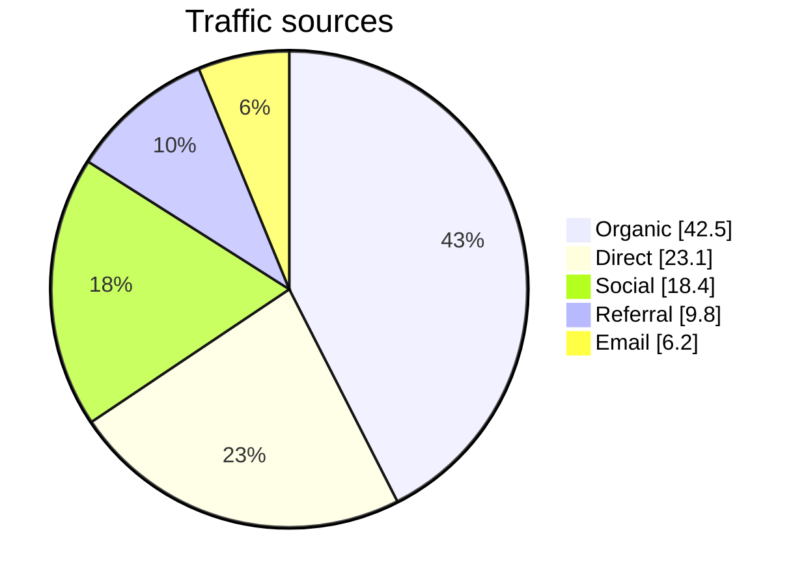

### Mindmap

[`examples/mindmap.mmd`](../../examples/mindmap.mmd) · [SVG](images/mindmap.svg)

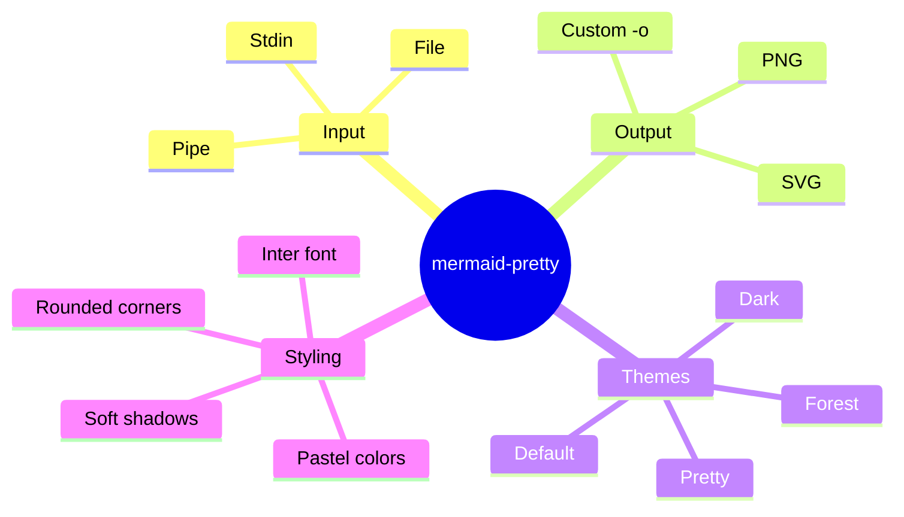

### Timeline

[`examples/timeline.mmd`](../../examples/timeline.mmd) · [SVG](images/timeline.svg)

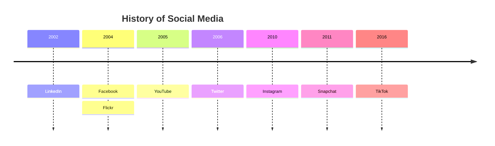

### Journey

[`examples/journey.mmd`](../../examples/journey.mmd) · [SVG](images/journey.svg)

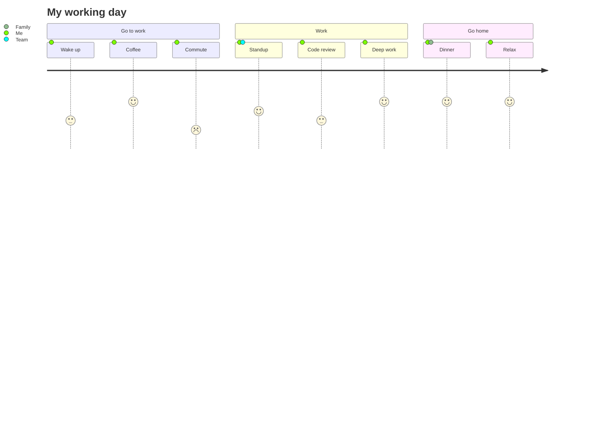

### GitGraph

[`examples/gitgraph.mmd`](../../examples/gitgraph.mmd) · [SVG](images/gitgraph.svg)

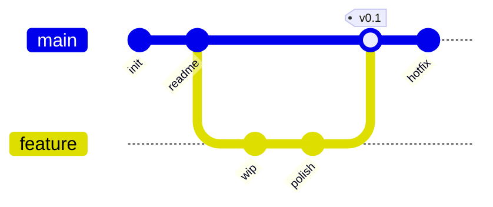

### Quadrant

[`examples/quadrant.mmd`](../../examples/quadrant.mmd) · [SVG](images/quadrant.svg)

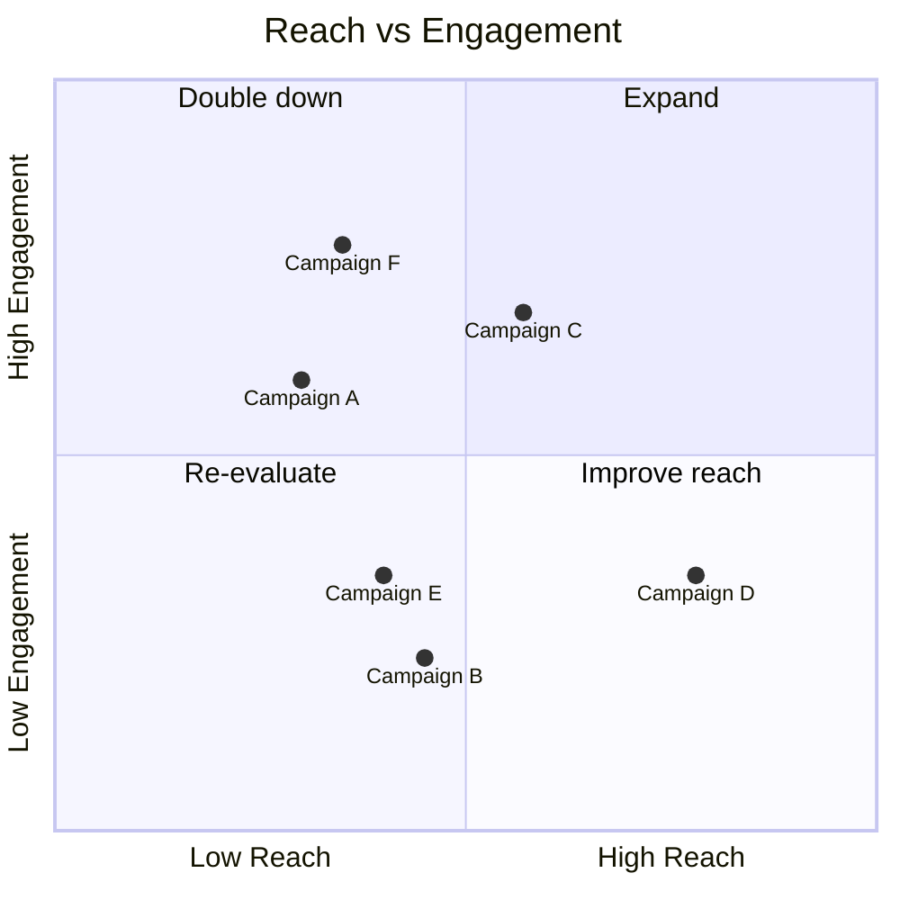

## Regenerate

```bash
for f in flowchart sequence class state er gantt pie mindmap timeline journey gitgraph quadrant; do
  mmp "examples/${f}.mmd" -o "docs/catalog/images/${f}"
done
```
